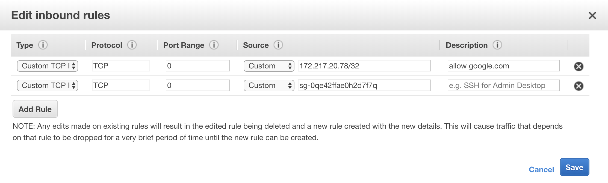

# AWS SecurityGroup ACL generator

This is a small (almost tiny) script, written in Python, which allows you to generate raw or formatted ACL / whitelists.

You can use this generated ACL in a rule for example to integrate within:

- `nginx`
- `haproxy`
- `apache`
- _…or any other server, service or application…_

By using this script, you are able to manage whitelists (or blacklists for that matter) without maintaining separate files scattered around multiple project and eventually having problems like unmanagability of all entries (e.g. IP addresses) which ultimately will have a risk of loosing tight security.

## Usage

Below an excerpt of a sample `docker-compose.yml` file:

```yaml
version: '3'

services:
  whitelist:
    container_name: whitelist
    image: maikelmertens/aws-securitygroup-acl:latest
    environment:
      - SECURITY_GROUP_IDS="sg-abc123def sg-ghi456jkl"
```

For more information on what parameters / environment variables you can use, please refer to chapter [Parameters](#Parameters).

## AWS

Below screenshot an example on how you may want to set up an _AWS Security Group_, although you have your own freedom on how you may want to set this thing up:



As you may already have noticed, you are **able to reference other AWS Security Groups too**, so that you can split up Security Groups in, for instance:

- Application whitelist (sepcific for the web application)
- Generic whitelist (where all common entries go, shared across multiple ACLs)
- _…whatever more you like…_

The level of nesting is practically limited to whatever AWS limits are applicable. This small scripts just recursively iterates over every _AWS Security Group_ it finds via the AWS CLI.

## Output

This script will generate the following output if you have selected `nginx` as `OUTPUT_FORMAT`:

```nginx
allow 172.217.20.78/32; # (from : sg-abc123def) allow google.com
allow 59.129.93.112/32; # (from : sg-0qe42ffae0h2d7f7q) maikel home
deny all;
```

Needless to say, if you enable the `blacklist` parameter, the output above will be inversed:

```nginx
deny 172.217.20.78/32; # (from : sg-abc123def) allow google.com
deny 59.129.93.112/32; # (from : sg-0qe42ffae0h2d7f7q) maikel home
allow all;
```


Or returns the following output when `plain` (default) has been selected as `OUTPUT_FORMAT`:

```pl
# from : sg-abc123def              allow google.com
172.217.20.78/32
# from : sg-0qe42ffae0h2d7f7q      maikel home
59.129.93.112/32
```

Ofcourse you can extend this script to include more outputs that fits your needs.

Currently the script is not too fancy in terms of extensibility (at this moment all code lives in one basic script, no classes, inheritence, etc), but might be overhauled in the future if the use case has been proven.

## Parameters

**The first and foremost important parameters are the ones that describes on how to get access to AWS via the CLI (from the `boto3` module of Python).**

Usually you want to provide at least:

- **AWS_ACCESS_KEY_ID**
- **AWS_SECRET_ACCESS_KEY**
- **AWS_DEFAULT_REGION**
- **AWS_REGION**

You might want to run this with temporary credentials fetched via `aws sts assume-role` by obtaining this via an attached _AWS IAM Instance Profile_ or some kind.

The following parameters can be provided to the Docker container as environment variables:

- **SECURITY_GROUP_IDS**

  _Required_

  The source _AWS Security Groups_ identifier (starts with `sg-`) to use for this particular whitelist.
  Must be provided at runtime, otherwise the script will exit.

- **CRON**

  _Default: `"*/5 * * * *"` (5 minutes)_

  You can alter this setting to change the polling time for this script to check for new, updated or deleted entries within the _AWS Security Group_ or every nested _AWS Security Group_.

- **OUTPUT_FORMAT**

  _Default: `plain`_

  Currently can be either `plain` or `nginx`.
  This allows you to specify in which format the script needs to generate the ACL.
  Please note: the `plain` mode can be used to feed `haproxy` ACLs.

- **OUTPUT_FILE**

  _Default: **sg_name**_

  Options can be: _**sg_name**, **stdout**, [file name]_
  Specifies the filename to store the output. **sg_name** is a placeholder to use the Security Group ID as filename, while **stdout** will redirect the entire output to stdout. If you choose a custom filename, it will be placed within the **OUTPUT_DIR** directory.

- **OUTPUT_DIR**

  _Default: /acl_

  Specifies the directory to store the output. Defaults to the `/acl` directory, and is exposed to other Docker containers by having the `volume` directive set and should not be changed.

- **BLACKLIST**

  _Default: false_

  Specifies whether to create a `blacklist` instead of a `whitelist`.

  Currently only has effect if you have `nginx` specified as `OUTPUT_FORMAT`, as there are no inner differences between a `whitelist` and `blacklist` when using `plain` as `OUTPUT_FORMAT`.


## How to integrate?

Basically I've wrote this script to support me in managing ACLs across several environments (DTAP) and with the intention to use common or generic whitelists across these environments so you won't have to repeat yourself (DRY), hence it will greatly improve the managebility of one or more ACLs.

At this moment I've used it for whitelists for `nginx` and for `haproxy`.
On these servers, there is a script installed whichs checks whether the whitelist (provided by this script) has been changed by checking the `checksum` of the file generated. If the `checksum` has been changed, I will seamlessly reload the server in order to reinit the whitelist entries, which allows me to manage whitelists without manual intervention on the server(s).

At the other side, I'm managing _AWS Security Groups_ with the help of some _Infrastructure as Code_ applications, like Terraform or Cloudformation.

The end result is a fully automated and managed environment with all the audit capabilities available to safeguard your applications en environments.
